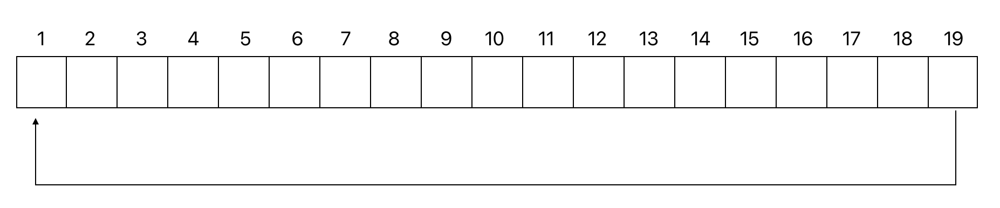

Ejercicio 1:

Escribe una classe que simuili el funcionament d'una cua de dades.
Es requereix que la cua estigui implementada mitjançant una taula circular de mida fixe.

Quan diem que la taula és circular és perquè ens imaginem
que per una taula de n posicions, la posició
següent a la n-1 es la 0. Per fer aquesta implementació usarem dos index que indicaran la posició del primer element i de l'ultim.

Amb l'estructura de dades definida d'aquesta manera volem implementar les operacions d'encuar un element, desecuar un element i to String de la cua.

Encuar un element implica inserir un element a l'estructura, per això s'ha de verificar que l cua no estigui plena, si ho esta es generara l'error pertinent. L'element s'inserira despres de l'ultim.

Desencuar un element implica extreure un element de l'estructura, per aixo s'ha de verificar que la cua no estigui buida, shi ho esta es generara l'error pertinent. L'element extret sera el que es troba a la primera posicio.

Noteu que en cap cas desplacem els elements, tant a l'hora d'encuar com de desencuar, simplement canviem les referencies del primer i de l'ultim.

El metode toString retornara una cadena de caracters amb tots els elements de la cua, des del primer fins a l'ultim, entre claudators.

Contingut de l'estructura circular: 
[1] 
[2] 
[3] 
...  
[n]
